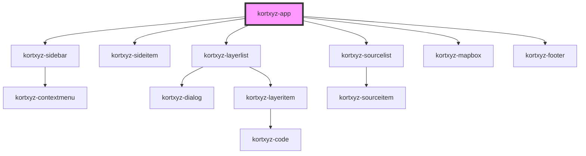

# kortxyz-app

<!-- Auto Generated Below -->

## Properties

| Property | Attribute | Description | Type     | Default     |
| -------- | --------- | ----------- | -------- | ----------- |
| `source` | `source`  |             | `string` | `undefined` |

## Dependencies

### Depends on

- [kortxyz-sidebar](..\kortxyz-sidebar)
- [kortxyz-sideitem](..\kortxyz-sideitem)
- [kortxyz-layerlist](..\kortxyz-layerlist)
- [kortxyz-sourcelist](..\kortxyz-sourcelist)
- [kortxyz-mapbox](..\kortxyz-mapbox)
- [kortxyz-footer](..\kortxyz-footer)

### Graph

----------------------------------------------

*Built with [StencilJS](https://stenciljs.com/)*
