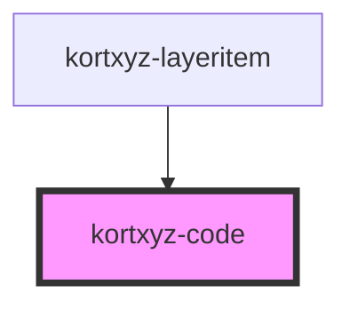

# kortxyz-code

<!-- Auto Generated Below -->

## Properties

| Property | Attribute | Description | Type     | Default     |
| -------- | --------- | ----------- | -------- | ----------- |
| `layer`  | `layer`   |             | `any`    | `undefined` |
| `left`   | `left`    |             | `number` | `0`         |
| `top`    | `top`     |             | `number` | `0`         |

## Dependencies

### Used by

 - [kortxyz-layeritem](..\kortxyz-layeritem)

### Graph

----------------------------------------------

*Built with [StencilJS](https://stenciljs.com/)*
