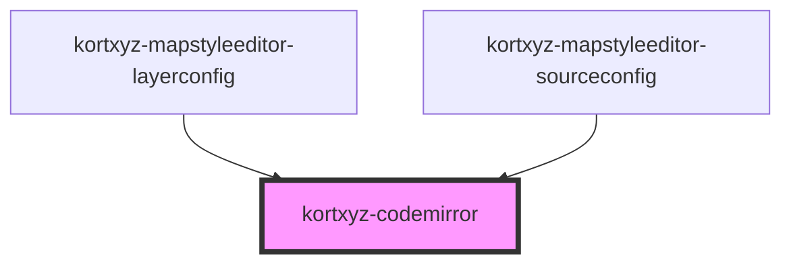

# kortxyz-codemirror

<!-- Auto Generated Below -->

## Properties

| Property | Attribute | Description | Type  | Default     |
| -------- | --------- | ----------- | ----- | ----------- |
| `doc`    | `doc`     |             | `any` | `undefined` |

## Events

| Event        | Description | Type               |
| ------------ | ----------- | ------------------ |
| `docChanged` |             | `CustomEvent<any>` |

## Dependencies

### Used by

 - [kortxyz-mapstyleeditor-layerconfig](../kortxyz-mapstyleeditor-layerconfig)
 - [kortxyz-mapstyleeditor-sourceconfig](../kortxyz-mapstyleeditor-sourceconfig)

### Graph

----------------------------------------------

*Built with [StencilJS](https://stenciljs.com/)*
