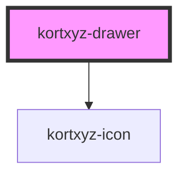

# kortxyz-drawer

<!-- Auto Generated Below -->

## Properties

| Property | Attribute | Description | Type     | Default |
| -------- | --------- | ----------- | -------- | ------- |
| `margin` | `margin`  |             | `string` | `"0"`   |

## Methods

### `addContent(content: any) => Promise<void>`

#### Parameters

| Name      | Type  | Description |
| --------- | ----- | ----------- |
| `content` | `any` |             |

#### Returns

Type: `Promise<void>`

## Dependencies

### Depends on

- [kortxyz-icon](../kortxyz-icon)

### Graph

----------------------------------------------

*Built with [StencilJS](https://stenciljs.com/)*
