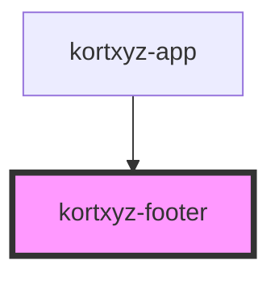

# kortxyz-footer

<!-- Auto Generated Below -->

## Properties

| Property   | Attribute   | Description                                 | Type     | Default |
| ---------- | ----------- | ------------------------------------------- | -------- | ------- |
| `gpsState` | `gps-state` | Handles if the GPS should be turn off or on | `string` | `"off"` |

## Dependencies

### Used by

 - [kortxyz-app](..\kortxyz-app)

### Graph

----------------------------------------------

*Built with [StencilJS](https://stenciljs.com/)*
