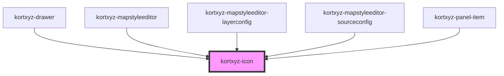

# kortxyz-icon

<!-- Auto Generated Below -->

## Properties

| Property | Attribute | Description | Type     | Default     |
| -------- | --------- | ----------- | -------- | ----------- |
| `color`  | `color`   |             | `string` | `"inherit"` |
| `icon`   | `icon`    |             | `string` | `'layers'`  |
| `size`   | `size`    |             | `string` | `"16"`      |

## Dependencies

### Used by

 - [kortxyz-drawer](../kortxyz-drawer)
 - [kortxyz-mapstyleeditor](../kortxyz-mapstyleeditor)
 - [kortxyz-mapstyleeditor-layerconfig](../kortxyz-mapstyleeditor-layerconfig)
 - [kortxyz-mapstyleeditor-sourceconfig](../kortxyz-mapstyleeditor-sourceconfig)
 - [kortxyz-panel-item](../kortxyz-panel-item)

### Graph

----------------------------------------------

*Built with [StencilJS](https://stenciljs.com/)*
