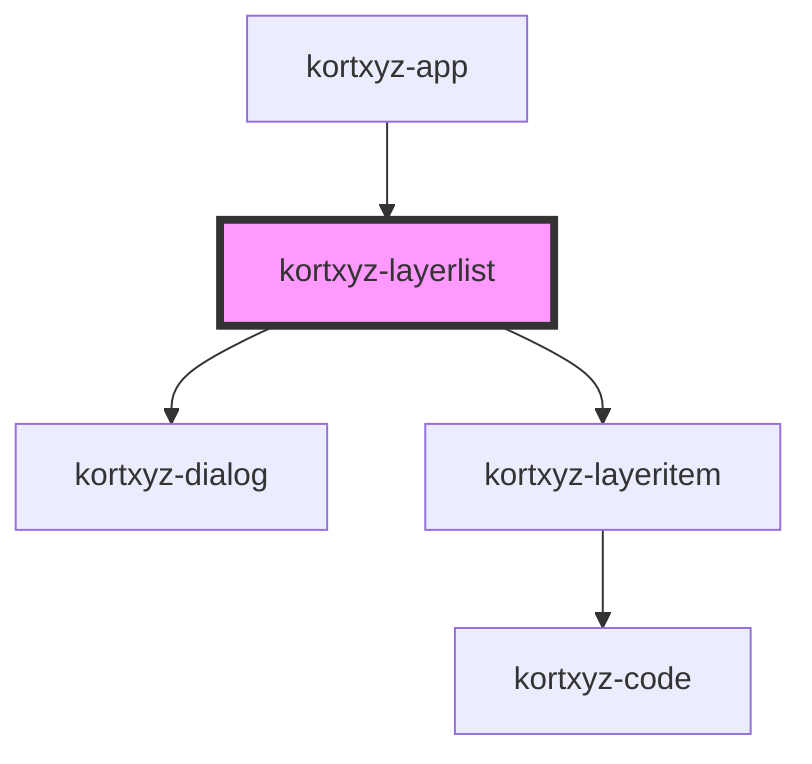

# kortxyz-layerlist

<!-- Auto Generated Below -->

## Properties

| Property     | Attribute       | Description | Type  | Default     |
| ------------ | --------------- | ----------- | ----- | ----------- |
| `sourcesURL` | `sources-u-r-l` |             | `any` | `undefined` |

## Events

| Event          | Description | Type               |
| -------------- | ----------- | ------------------ |
| `layerRemoved` |             | `CustomEvent<any>` |

## Methods

### `handleFile(e: any) => Promise<void>`

#### Returns

Type: `Promise<void>`

## Dependencies

### Used by

 - [kortxyz-app](..\kortxyz-app)

### Depends on

- [kortxyz-dialog](..\kortxyz-dialog)
- [kortxyz-layeritem](..\kortxyz-layeritem)

### Graph

----------------------------------------------

*Built with [StencilJS](https://stenciljs.com/)*
