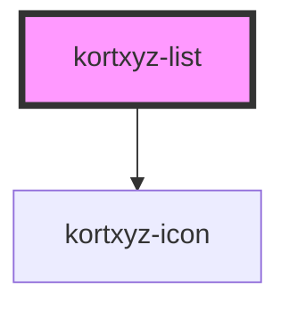

# kortxyz-list

<!-- Auto Generated Below -->

## Properties

| Property      | Attribute     | Description                                      | Type      | Default     |
| ------------- | ------------- | ------------------------------------------------ | --------- | ----------- |
| `accept`      | `accept`      | Which file will be accepted                      | `any`     | `undefined` |
| `data`        | `data`        | Url to the API that returns the list             | `any`     | `undefined` |
| `description` | `description` | Variable to use for description                  | `any`     | `undefined` |
| `group`       | `group`       | Object in the response that contains the list    | `any`     | `undefined` |
| `header`      | `header`      | Variable to use for header                       | `any`     | `undefined` |
| `name`        | `name`        | Variable to use for title                        | `any`     | `undefined` |
| `uploadtile`  | `uploadtile`  | Show a tile for uplaoding files to the data path | `boolean` | `false`     |

## Methods

### `addUploadingTile(name: any, file: File) => Promise<void>`

#### Parameters

| Name   | Type   | Description |
| ------ | ------ | ----------- |
| `name` | `any`  |             |
| `file` | `File` |             |

#### Returns

Type: `Promise<void>`

## Dependencies

### Depends on

- [kortxyz-icon](../kortxyz-icon)

### Graph

----------------------------------------------

*Built with [StencilJS](https://stenciljs.com/)*
