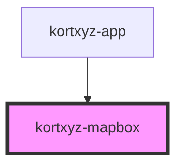

# my-component

<!-- Auto Generated Below -->

## Properties

| Property      | Attribute     | Description | Type     | Default                                                                                                          |
| ------------- | ------------- | ----------- | -------- | ---------------------------------------------------------------------------------------------------------------- |
| `accesstoken` | `accesstoken` |             | `string` | `undefined`                                                                                                      |
| `map`         | --            |             | `Map`    | `undefined`                                                                                                      |
| `mapstyle`    | `mapstyle`    |             | `any`    | `{ "version": 8, "name": "Empty", "metadata": { "mapbox:autocomposite": true },  "sources":{},   "layers": [] }` |

## Events

| Event          | Description | Type               |
| -------------- | ----------- | ------------------ |
| `layerAdded`   |             | `CustomEvent<any>` |
| `layerRemoved` |             | `CustomEvent<any>` |
| `mapLoaded`    |             | `CustomEvent<any>` |
| `newStyle`     |             | `CustomEvent<any>` |
| `sourceAdded`  |             | `CustomEvent<any>` |

## Methods

### `addLayer(name: any, source: any) => Promise<void>`

#### Returns

Type: `Promise<void>`

### `zoomToFeatures(features: any) => Promise<void>`

#### Returns

Type: `Promise<void>`

## Dependencies

### Used by

 - [kortxyz-app](..\kortxyz-app)

### Graph

----------------------------------------------

*Built with [StencilJS](https://stenciljs.com/)*
