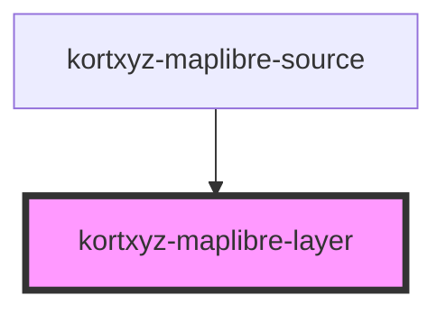

# kortxyz-maplibre-layer
<!-- Auto Generated Below -->


## Overview

## Intro
Webcomponent to load a maplibre layer inside a maplibre source. The layer can be made click interactive be using either clicklink or the popup properties.

Paint and Layout properties follow [MapLibre Style Spec](https://maplibre.org/maplibre-style-spec/layers/).


## Example
 Show red polygons with a white outline that opens a page when clicked.
```html
<kortxyz-maplibre>
   <kortxyz-maplibre-source>
       <kortxyz-maplibre-layer
           type="line"
           paint="{line-color:white}"
       ></kortxyz-maplibre-layer>
       <kortxyz-maplibre-layer
           type="fill"
           paint="{fill-color:red}"
           clicklink="https://example.com/{placename}"
       ></kortxyz-maplibre-layer>
   </kortxyz-maplibre-source>
</kortxyz-maplibre>
```

## Properties

| Property      | Attribute      | Description                                                                                                                                                   | Type                           | Default                                     |
| ------------- | -------------- | ------------------------------------------------------------------------------------------------------------------------------------------------------------- | ------------------------------ | ------------------------------------------- |
| `clicklink`   | `clicklink`    | (optional) When clicking a feature a new webpage is opened with the link prop. {} can be used to replace with a attribute. https://mypage.org/{ATTRIBUTENAME} | `any`                          | `undefined`                                 |
| `filter`      | `filter`       | Expression to fitler the layer                                                                                                                                | `any`                          | `undefined`                                 |
| `id`          | `id`           |                                                                                                                                                               | `string`                       | `Math.random().toString(36).substring(2,7)` |
| `layout`      | `layout`       | Layout properties for the layer.                                                                                                                              | `any`                          | `undefined`                                 |
| `paint`       | `paint`        | Paint properties for the layer.                                                                                                                               | `any`                          | `{}`                                        |
| `popup`       | `popup`        | (optional) When clicking a feature a Popup shows. Accept HTML and replacement of {} with a attribute. \<div>{placename}\</div>                                | `boolean \| string`            | `undefined`                                 |
| `sourceLayer` | `source-layer` | Layer to use from a vector tile source. Required for vector tile sources; prohibited for all other source types, including GeoJSON sources.                   | `string`                       | `undefined`                                 |
| `type`        | `type`         | Type of layer                                                                                                                                                 | `"circle" \| "fill" \| "line"` | `'fill'`                                    |


## Events

| Event            | Description                              | Type               |
| ---------------- | ---------------------------------------- | ------------------ |
| `featureClicked` | Emit the ID of the first feature clicked | `CustomEvent<any>` |


## Dependencies

### Used by

 - [kortxyz-maplibre-source](../kortxyz-maplibre-source)

### Graph


----------------------------------------------

*Built with [StencilJS](https://stenciljs.com/)*
