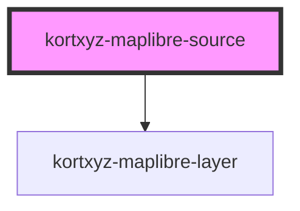

# kortxyz-maplibre-source

<!-- Auto Generated Below -->


## Overview

## Intro
Webcomponent load a new source into a kortxyz-maplibre component. An id is autogenerated if not present.

## Example
 Load a geojson source
```html
<kortxyz-maplibre>
   <kortxyz-maplibre-source
       sourceid="afstemningsomraader"
       data="https://api.dataforsyningen.dk/afstemningsomraader?kommunekode=183&&format=geojson"
   ></kortxyz-maplibre-source>
<kortxyz-maplibre>

```

 Load a raster source
```html
<kortxyz-maplibre>
   <kortxyz-maplibre-source
       sourceid="orto_foraar_webm"
       type="raster"
       tilesize="256" 
       maxzoom="20" 
       tiles="https://api.dataforsyningen.dk/orto_foraar_webm_DAF?SERVICE=WMTS&REQUEST=GetTile&VERSION=1.0.0&LAYER=orto_foraar_webm&STYLE=default&FORMAT=image%2Fjpeg&TILEMATRIXSET=DFD_GoogleMapsCompatible&TILEMATRIX={z}&TILEROW={y}&TILECOL={x}&token=<INSERT TOKEN>">
   ></kortxyz-maplibre-source>
<kortxyz-maplibre>

```

## Properties

| Property     | Attribute    | Description                                                                                               | Type                                | Default                                     |
| ------------ | ------------ | --------------------------------------------------------------------------------------------------------- | ----------------------------------- | ------------------------------------------- |
| `autolayers` | `autolayers` | add a layer without specifing it. If no kortxyz-maplibre-layer children, it is automatically set to true. | `boolean`                           | `false`                                     |
| `data`       | `data`       | URL to the geojson source.                                                                                | `string`                            | `undefined`                                 |
| `fit`        | `fit`        | fit mapbounds to geojsonbounds                                                                            | `boolean`                           | `false`                                     |
| `maxzoom`    | `maxzoom`    | Max zoom-level to fetch tiles. z-parameter                                                                | `number`                            | `14`                                        |
| `sourceid`   | `sourceid`   | Source identification                                                                                     | `string`                            | `Math.random().toString(36).substring(2,7)` |
| `store`      | `store`      | Datastore reference.                                                                                      | `string`                            | `undefined`                                 |
| `tiles`      | `tiles`      | Url to the tilesource. e.g. https://demotiles.maplibre.org/tiles/{z}/{x}/{y}.pbf                          | `string`                            | `undefined`                                 |
| `tilesize`   | `tilesize`   | Size of the tiles in px.                                                                                  | `number`                            | `512`                                       |
| `type`       | `type`       | Type of source.                                                                                           | `"geojson" \| "raster" \| "vector"` | `'geojson'`                                 |


## Dependencies

### Depends on

- [kortxyz-maplibre-layer](../kortxyz-maplibre-layer)

### Graph


----------------------------------------------

*Built with [StencilJS](https://stenciljs.com/)*
