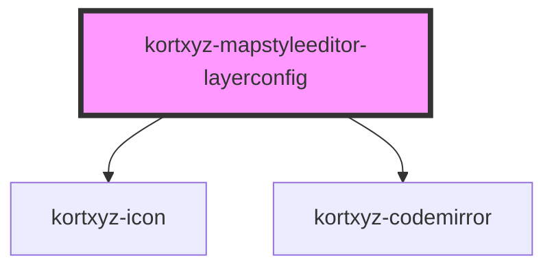

# kortxyz-mapstyleeditor-layerconfig

<!-- Auto Generated Below -->

## Properties

| Property  | Attribute | Description | Type     | Default     |
| --------- | --------- | ----------- | -------- | ----------- |
| `layerid` | `layerid` |             | `string` | `undefined` |

## Events

| Event         | Description | Type               |
| ------------- | ----------- | ------------------ |
| `closeConfig` |             | `CustomEvent<any>` |

## Dependencies

### Depends on

- [kortxyz-icon](../kortxyz-icon)
- [kortxyz-codemirror](../kortxyz-codemirror)

### Graph

----------------------------------------------

*Built with [StencilJS](https://stenciljs.com/)*
