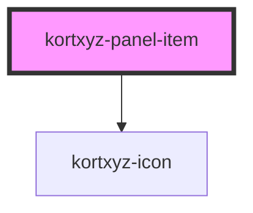

# kortxyz-panel-item

<!-- Auto Generated Below -->

## Properties

| Property | Attribute | Description | Type      | Default     |
| -------- | --------- | ----------- | --------- | ----------- |
| `active` | `active`  |             | `boolean` | `undefined` |
| `icon`   | `icon`    |             | `string`  | `undefined` |
| `link`   | `link`    |             | `string`  | `undefined` |
| `panel`  | `panel`   |             | `string`  | `undefined` |

## Events

| Event         | Description | Type               |
| ------------- | ----------- | ------------------ |
| `tooglePanel` |             | `CustomEvent<any>` |

## Dependencies

### Depends on

- [kortxyz-icon](../kortxyz-icon)

### Graph

----------------------------------------------

*Built with [StencilJS](https://stenciljs.com/)*
