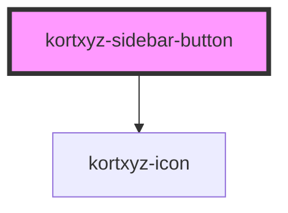

# kortxyz-sidebar-button

<!-- Auto Generated Below -->

## Properties

| Property    | Attribute   | Description                              | Type                            | Default    |
| ----------- | ----------- | ---------------------------------------- | ------------------------------- | ---------- |
| `icon`      | `icon`      | Which icon to use from kortxyz-icon      | `string`                        | `"layers"` |
| `placement` | `placement` | Where in the sidebar to place the button | `"bottom" \| "middle" \| "top"` | `"top"`    |

## Events

| Event           | Description | Type               |
| --------------- | ----------- | ------------------ |
| `toggleRequest` |             | `CustomEvent<any>` |

## Dependencies

### Depends on

- [kortxyz-icon](../kortxyz-icon)

### Graph

----------------------------------------------

*Built with [StencilJS](https://stenciljs.com/)*
