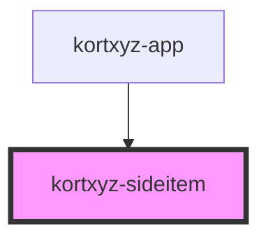

# kortxyz-sideitem

<!-- Auto Generated Below -->

## Properties

| Property | Attribute | Description | Type      | Default     |
| -------- | --------- | ----------- | --------- | ----------- |
| `icon`   | `icon`    |             | `string`  | `undefined` |
| `name`   | `name`    |             | `string`  | `undefined` |
| `small`  | `small`   |             | `boolean` | `undefined` |
| `width`  | --        |             | `Number`  | `200`       |

## Events

| Event            | Description | Type               |
| ---------------- | ----------- | ------------------ |
| `sidebarResized` |             | `CustomEvent<any>` |

## Dependencies

### Used by

 - [kortxyz-app](..\kortxyz-app)

### Graph

----------------------------------------------

*Built with [StencilJS](https://stenciljs.com/)*
