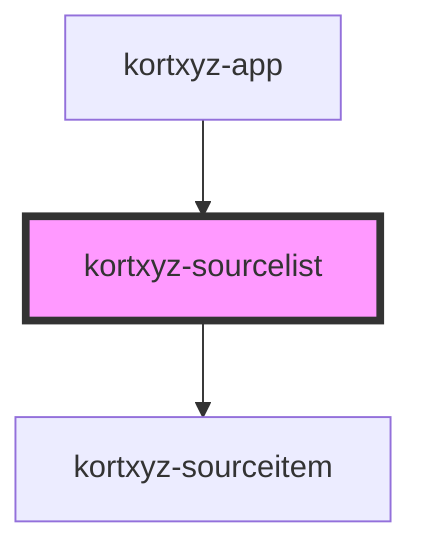

# kortxyz-sourcelist

<!-- Auto Generated Below -->

## Methods

### `handleFile(e: any) => Promise<void>`

#### Returns

Type: `Promise<void>`

## Dependencies

### Used by

 - [kortxyz-app](..\kortxyz-app)

### Depends on

- [kortxyz-sourceitem](..\kortxyz-sourceitem)

### Graph

----------------------------------------------

*Built with [StencilJS](https://stenciljs.com/)*
