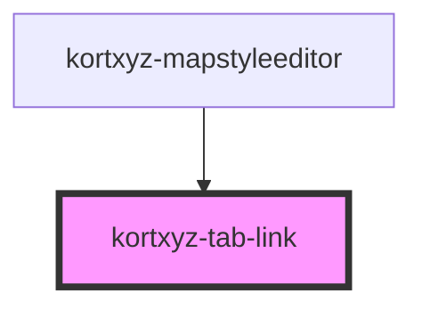

# kortxyz-tab-link

<!-- Auto Generated Below -->

## Properties

| Property | Attribute | Description | Type      | Default     |
| -------- | --------- | ----------- | --------- | ----------- |
| `active` | `active`  |             | `boolean` | `false`     |
| `for`    | --        |             | `String`  | `undefined` |

## Events

| Event       | Description | Type               |
| ----------- | ----------- | ------------------ |
| `tabChange` |             | `CustomEvent<any>` |

## Dependencies

### Used by

 - [kortxyz-mapstyleeditor](../kortxyz-mapstyleeditor)

### Graph

----------------------------------------------

*Built with [StencilJS](https://stenciljs.com/)*
